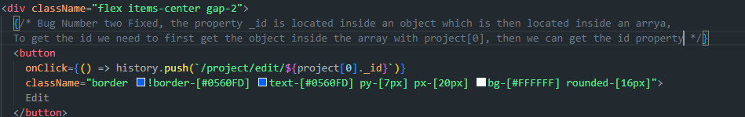

# Bug Fixes

> We couldn't get the name of the project because it is an object in an Array, therefore we need to get the object from the array first before with `project[0]`

Bug Number two Fixed, the property _id is located inside an object which is then located inside an arrya, to get the id we need to first get the object inside the array with project[0], then we can get the id property *
             

> Fixed undefined error on getting the values from the project

> the add-input-to-a-list function,  We needed to add the input to the values array first before mapping through the array to display each added item, This requires us to run the the mapping of the values after the form submission

We need to call the handleSubmit function when the button is clicked not on the onChange
                    

FIXED the name of the project was not being displayed

# Feature Added 
  
In the frontend code, I've added a button labeled "Delete all projects" that triggers the deletion of all projects when clicked. When the button is clicked, it first clears the local state variable projects to ensure that the frontend reflects the changes after deletion. Then, it prompts the user with a confirmation dialog to confirm whether they want to proceed with the deletion. If the user confirms, it sends a DELETE request to the backend API endpoint "/project/" using the api.remove function. Upon successful deletion, it displays a success toast message using toast.success and redirects the user to the "/project" page using history.push("/project").

In the backend code, I've implemented a route handler for DELETE requests at the "/" endpoint. This route is protected by the Passport middleware, ensuring that only authenticated users can access it. Inside the route handler, I use ProjectObject.deleteMany({}) to delete all documents in the "ProjectObject" collection in the MongoDB database. If the operation is successful, I send a 200 OK response with { ok: true }. If an error occurs during the deletion process, I catch it, log it to the console for debugging purposes, and send a 500 Internal Server Error response with details about the error.

# Technical test

## Introduction

Fabien just came back from a meeting with an incubator and told them we have a platform “up and running” to monitor people's activities and control the budget for their startups !

All others developers are busy and we need you to deliver the app for tomorrow.
Some bugs are left and we need you to fix those. Don't spend to much time on it.

We need you to follow these steps to understand the app and to fix the bug : 
 - Sign up to the app
 - Create at least 2 others users on people page ( not with signup ) 
 - Edit these profiles and add aditional information 
 - Create a project
 - Input some information about the project
 - Input some activities to track your work in the good project
  
Then, see what happens in the app and fix the bug you found doing that.

## Then
Time to be creative, and efficient. Do what you think would be the best for your product under a short period.

### The goal is to fix at least 3 bugs and implement 1 quick win feature than could help us sell the platform

## Setup api

- cd api
- Run `npm i`
- Run `npm run dev`

## Setup app

- cd app
- Run `npm i`
- Run `npm run dev`

## Finally

Send us the project and answer to those simple questions : 
- What bugs did you find ? How did you solve these and why ? 
- Which feature did you develop and why ? 
- Do you have any feedback about the code / architecture of the project and what was the difficulty you encountered while doing it ? 

# Bug Fixes

# Feature Added 
  

